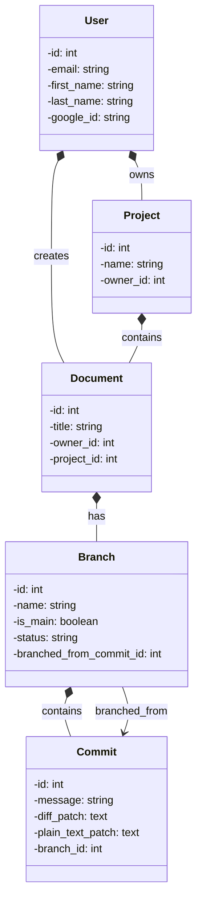
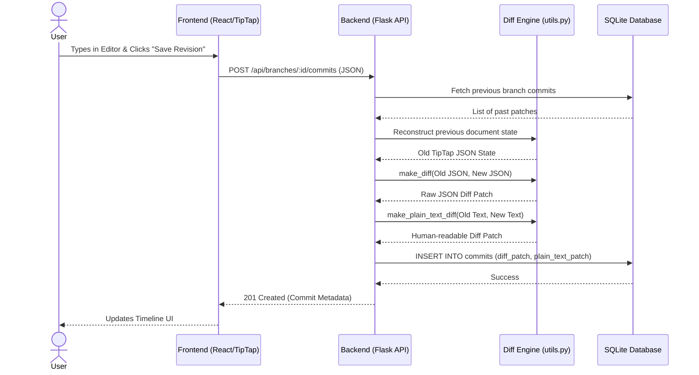

# DocuCommit

**TLDR:** Semantic version control for documents (Google Docs, Word, etc.), specifically targeting the legal sector.

## Project Description

DocuCommit is a web-based platform that brings the power of Git-style version control (branching, committing, and merging) to plain-text legal contracts and policy documents. It translates complex version control concepts into a highly visual, non-technical interface suitable for lawyers, local government clerks, and standard-setting organizations.

Launching software in this space would be interesting since it shifts the paradigm away from sending emails with chaotic "Contract_LawyerOne_Final_Edit_v10.docx" to a more structured DAG of the document history. Moreover, it would allow for easier review of changes to the document, specifically reducing the time that more senior members of the team review the changes made by interns or junior-level coworkers. From a technical perspective, it presents a fantastic software engineering challenge: building a robust Python backend to calculate text diffs, manage parallel document states, and resolve merge conflicts, paired with a dynamic React frontend to visualize the document tree.

## Local Setup Instructions

To get the application running on your local machine, you'll need to boot up both the backend (Flask) and frontend (React/Vite).

### 1. Backend Setup

The backend requires a `.env` file in the `Frank/` directory to manage its configuration. You can copy the provided `.env.example` file to get started:

```bash
cd Frank
python3 -m venv venv
source venv/bin/activate
pip install -r requirements.txt
cp .env.example .env
flask run
```

#### Environment Variables Reference

When you copy `.env.example` to `.env`, you will see the following configuration keys (actual secret values are omitted here for security):

- **`DATABASE_URL`**: The connection string for the database (defaults to a local SQLite file for development).
- **`SECRET_KEY`**: Used by Flask for cryptographic operations and session security. In a development environment, any random string will work.
- **`DEBUG`**: Set to `true` to enable Flask's debug mode and hot-reloading during development.

### 2. Frontend Setup

Open a new terminal window:

```bash
cd client
npm install
npm run dev
```

Both services will start, and the frontend terminal will provide a `localhost` URL to access DocuCommit in your browser.

## API Documentation

All backend routes are mounted under `/api`. Most document routes require a logged-in session; use the auth endpoints first when testing with curl, Postman, or the React app.

### Auth

| Method | Route | Body | Notes |
| --- | --- | --- | --- |
| `POST` | `/api/auth/register` | `{ "username": "...", "password": "..." }` | Creates an account and logs the user in. |
| `POST` | `/api/auth/login` | `{ "username": "...", "password": "..." }` | Starts a session. |
| `POST` | `/api/auth/logout` | none | Ends the current session. |
| `GET` | `/api/auth/me` | none | Returns the current logged-in user. |

### Documents

| Method | Route | Body | Notes |
| --- | --- | --- | --- |
| `GET` | `/api/documents` | none | Lists the current user's documents. |
| `POST` | `/api/documents` | `{ "title": "...", "content": "..." }` | Creates a document and its `Main` branch. |
| `GET` | `/api/documents/:id` | none | Gets one document with current Main content. |
| `PUT` | `/api/documents/:id` | `{ "title": "...", "content": "..." }` | Updates the title and optionally commits new Main content. |
| `DELETE` | `/api/documents/:id` | none | Deletes a document and its branches/commits. |
| `GET` | `/api/documents/:id/commits` | none | Lists commits across all branches for the document. |

### Branches, Commits, and Merge

| Method | Route | Body / Query | Notes |
| --- | --- | --- | --- |
| `GET` | `/api/documents/:id/branches` | none | Lists branches for a document. |
| `POST` | `/api/documents/:id/branches` | `{ "name": "...", "source_branch_id": 1 }` | Creates a branch. `source_branch_id` is optional. |
| `GET` | `/api/branches/:id` | none | Gets one branch and its reconstructed content. |
| `GET` | `/api/branches/:id/commits` | none | Lists commits on a branch. |
| `POST` | `/api/branches/:id/commits` | `{ "message": "...", "content": "..." }` | Saves a revision if the content changed. |
| `GET` | `/api/branches/:id/diff` | optional `?w=1` | Compares the branch to Main. `w=1` ignores whitespace-only changes. |
| `POST` | `/api/branches/:id/merge` | none | Merges an active branch into Main when Main has not diverged. |

## Architecture & Design

### Database UML Class Diagram
DocuCommit relies on a highly relational data model to translate Git-style version control concepts into a robust backend architecture. The following UML diagram illustrates the Code/Data view of the SQLAlchemy models:



### Version Control Workflow
The most complex feature in DocuCommit is the diffing engine. The following sequence diagram visualizes the Behavioral View of how the React client, Flask API, Diff Engine, and SQLite database interact to generate and store a revision patch.



## User Stories
### Must Have (Basically all the core version control logic)

**Document Initialization**

- **Story:** As a user, I want to create a new "Main" document repository so that I have a base text to start drafting my contract.
- **Acceptance Criteria:**
  - The user can click "New Document", input a title, and type initial text into an editor.
  - Upon saving, the backend creates a "Main" branch with an initial commit timestamp.
  - The document appears in the user's dashboard.

**Branch Creation** (Depends on Story 1)

- **Story:** As a collaborator, I want to create a separate "Branch" of the document so that I can draft experimental clauses without altering the main contract.
- **Acceptance Criteria:**
  - While viewing a document, the user can click "New Branch" and provide a branch name (e.g., "Liability_Revision").
  - The system creates an isolated copy of the text at that exact timestamp.
  - Edits made in this branch do not affect the "Main" branch text.

**Committing Revisions** (Depends on Story 2)

- **Story:** As a drafter, I want to save "Commits" (revisions) with a short descriptive message so that I have a chronological history of my specific changes.
- **Acceptance Criteria:**
  - After editing text in a branch, the user clicks "Save Revision" and is prompted for a brief message (e.g., "Updated payment terms").
  - The backend saves the delta/diff of the text, not just a full duplicate file, appending it to the branch's history ledger.

### Should Have (Important for collaboration and utility)

**Visual Diffing** (Depends on Story 3)

- **Story:** As a reviewer, I want to visually compare my branch against the main document so that I can see exactly what words were added or removed.
- **Acceptance Criteria:**
  - The user can toggle a "Compare to Main" view.
  - The React frontend renders the text comparison: newly added words are highlighted in green, and removed words are struck through and highlighted in red.

**Diff API**

- `GET /api/branches/:id/diff` compares a branch against the document's Main branch.
- The response includes branch/Main metadata, word-level diff chunks, add/remove/unchanged/modified counts, and an optional whitespace-ignore mode using `?w=1`.

**Clean Merging** (Depends on Story 3 & 4)

- **Story:** As a lead drafter, I want to merge a finalized branch back into the main document so that the official contract is updated.
- **Acceptance Criteria:**
  - If the "Main" branch has not been altered since the branch was created, clicking "Merge" successfully overwrites the Main text with the Branch text.
  - The Branch is marked as "Merged" and archived.

### Nice to Have (More advanced functionality)

**Conflict Resolution UI** (Depends on Story 5)

- **Story:** As a lead drafter, I want the system to alert me if someone else changed the main document while I was working on my branch, so I can manually choose which text to keep.
- **Acceptance Criteria:**
  - If the system detects overlapping edits during a merge, it halts the merge.
  - A side-by-side UI appears showing "Current Main" vs. "Incoming Branch", forcing the user to click which block of text to accept before finalizing the merge.

**Formal Export**

- **Story:** As a lawyer, I want to export the current state of the main branch to a clean PDF so that I can send it to a client for physical signature.
- **Acceptance Criteria:**
  - A "Download PDF" button generates a cleanly formatted, print-ready document devoid of any version control UI elements.

## Intermediate Milestones

### Milestone 1: Environment & Core Data Models (Target: Week 4)

- **Goal:** Establish the foundational architecture and implement User Story 1.
- **Focus:** Setting up the frontend and backend repositories, configuring the database schema to handle document nodes, and building the basic text editor UI.
- **Demonstration:** You can run the app locally, create a new document with some text, save it, and see it persist in the database upon page refresh.

### Milestone 2: The Version Control Engine (Target: Week 7)

- **Goal:** Implement the complex logic of branching, saving revisions, and calculating diffs, covering User Stories 2, 3, and 4.
- **Focus:** Writing the Python backend logic that handles text deltas and building the React UI components that highlight those differences in red and green.
- **Demonstration:** A user can create a document, branch off of it, make several tracked changes (commits) in the branch, and view a visual comparison of their edits against the original text.

### Milestone 3: Merging & Final Polish (Target: Week 9 / End of Quarter)

- **Goal:** Complete the collaborative loop and prepare the project for final grading, covering User Story 5 (and Story 6/7 if time permits).
- **Focus:** Ensuring the merge logic works flawlessly, polishing the UI/UX, fixing edge cases, and finalizing documentation.
- **Demonstration:** The final presentation will showcase a complete workflow: creating a base contract, having two team members branch off to edit different clauses, reviewing the visual diffs, and seamlessly merging both branches back into a finalized main document.
