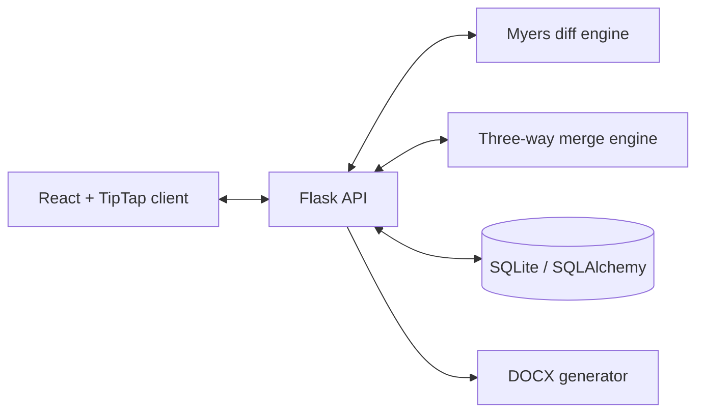
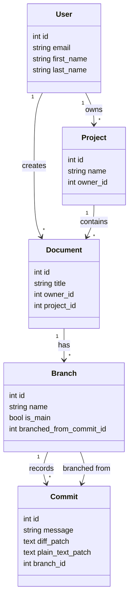

# DocuCommit

[](https://github.com/dangjacob101/DocuCommit/actions/workflows/ci.yml)
[](LICENSE)

Version control for rich-text documents, presented through a workflow designed
for people who do not use Git.

DocuCommit lets a user organize documents into projects, create isolated
branches, save named revisions, compare a branch with Main, and merge changes
through a visual conflict-resolution flow. It was developed as a UCLA CS 35L
team project with legal and policy-document workflows in mind.

> [!NOTE]
> DocuCommit is an educational prototype, not a production document-management
> service. Do not use it to store confidential or legally privileged material.

## Features

- **Document history:** revisions are stored as unified-diff patches and
  reconstructed by replaying the commit chain.
- **Isolated branches:** users can explore edits without modifying Main.
- **Visual comparison:** line-level and word-level diffs highlight additions,
  removals, and modifications, with an option to ignore whitespace.
- **Three-way merge:** divergent edits are classified as automatic changes or
  conflicts, and conflicts can be resolved from Main, the branch, or custom
  text.
- **Rich-text editing:** the TipTap editor supports headings, lists, bold,
  italic, underline, and font sizing.
- **Project organization:** documents are grouped into user-owned workspaces
  with title search and revision history.
- **Authentication and export:** email/password authentication, optional Google
  OAuth, profile images, and DOCX export are supported.

## Architecture

The React client talks to a Flask JSON API. SQLAlchemy persists users, projects,
documents, branches, and commits in SQLite for local development. The custom
diff and merge engines are independent Python modules, which keeps their core
algorithms testable without HTTP or database setup.



### Data model



### Revision flow

1. The client sends updated TipTap JSON to a branch commit endpoint.
2. The backend reconstructs the branch's current state by replaying its patches.
3. The Myers diff engine computes the new machine-readable and human-readable
   deltas.
4. SQLAlchemy stores the deltas as the next commit in that branch.
5. For a merge, the backend reconstructs the branch point, Main, and the
   incoming branch before running the three-way merge engine.

## Technology

| Layer | Technologies |
| --- | --- |
| Frontend | React, Vite, TipTap, React Router |
| Backend | Python, Flask, SQLAlchemy |
| Storage | SQLite locally; configurable through `DATABASE_URL` |
| Algorithms | Custom Myers O(ND) diff and three-way merge engines |
| Testing | Python integration tests, Vitest, Testing Library, Playwright |

## Quick start

### Prerequisites

- Python 3.9 or newer
- Node.js 20.19 or newer
- GNU Make

### Install

```bash
git clone https://github.com/dangjacob101/DocuCommit.git
cd DocuCommit
make install
cp Frank/.env.example Frank/.env
```

Replace the development `SECRET_KEY` in `Frank/.env` before starting the
backend. Google OAuth variables are optional; email/password registration works
without them.

### Run

Start the backend:

```bash
cd Frank
./.venv/bin/flask --app app run
```

In a second terminal, start the client:

```bash
cd client
npm run dev
```

Open <http://localhost:5173> and create an account. The Vite development server
proxies `/api` requests to Flask at <http://127.0.0.1:5000>.

### Configuration

| Variable | Required | Default | Purpose |
| --- | --- | --- | --- |
| `DATABASE_URL` | No | `sqlite:///documents.db` | SQLAlchemy database URL |
| `SECRET_KEY` | Yes outside local development | `dev-secret-key` | Flask session signing |
| `DEBUG` | No | `false` | Flask debug mode |
| `GOOGLE_CLIENT_ID` | Only for Google OAuth | none | OAuth client ID |
| `GOOGLE_CLIENT_SECRET` | Only for Google OAuth | none | OAuth client secret |
| `GOOGLE_REDIRECT_URI` | No | local callback URL | OAuth callback override |

## Tests

The repository includes backend algorithm and API tests, frontend unit/component
tests, and Playwright end-to-end flows.

```bash
make test          # backend + frontend tests
make e2e           # browser tests
make check         # backend, frontend, build, and browser checks
```

To run the health check without downloading or starting a browser:

```bash
SKIP_E2E=1 ./check_health.sh
```

GitHub Actions runs the same checks for pushes and pull requests.

## API overview

All endpoints are mounted under `/api`.

| Area | Representative endpoints |
| --- | --- |
| Authentication | `POST /auth/register`, `POST /auth/login`, `POST /auth/logout`, `GET /auth/me` |
| Projects | `GET/POST /projects`, `GET/PATCH/DELETE /projects/:id` |
| Documents | `GET/POST /documents`, `GET/PUT/DELETE /documents/:id`, `GET /documents/:id/export` |
| Branches | `GET/POST /documents/:id/branches`, `GET /branches/:id` |
| Revisions | `GET/POST /branches/:id/commits`, `GET /documents/:id/commits` |
| Compare and merge | `GET /branches/:id/diff`, `GET /branches/:id/merge/preview`, `POST /branches/:id/merge` |

Most data endpoints require an authenticated session. The React client sends
session cookies automatically.

## Repository layout

```text
DocuCommit/
├── Frank/                  Flask API, data model, diff/merge engines, tests
│   └── routes/             Resource-oriented API blueprints
├── client/                 React application
│   ├── e2e/                Playwright flows
│   └── src/test/           Vitest and Testing Library tests
├── .github/workflows/      Continuous integration
├── Makefile                Common installation and verification commands
└── check_health.sh         Local all-checks runner
```

## Contributors

DocuCommit was built collaboratively. The following contributor accounts are
recorded in the repository's Git history and GitHub contributor graph:

- [@robertpflores](https://github.com/robertpflores)
- [@samsam324](https://github.com/samsam324)
- [@dangjacob101](https://github.com/dangjacob101)
- [@TheEpicElliott](https://github.com/TheEpicElliott)
- [@derekk024](https://github.com/derekk024)
- [@Jacob-Dang-05](https://github.com/Jacob-Dang-05)

See the commit and pull-request history for feature-level attribution.

## License

DocuCommit is available under the [MIT License](LICENSE).
